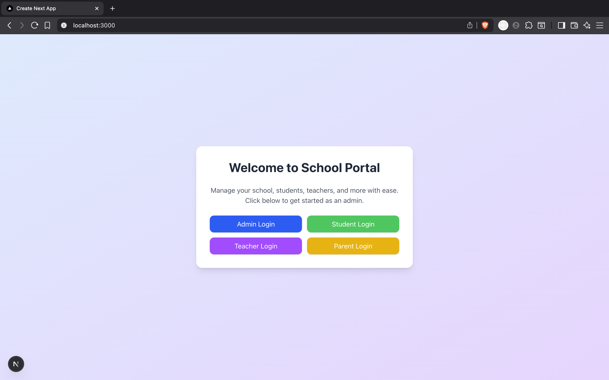
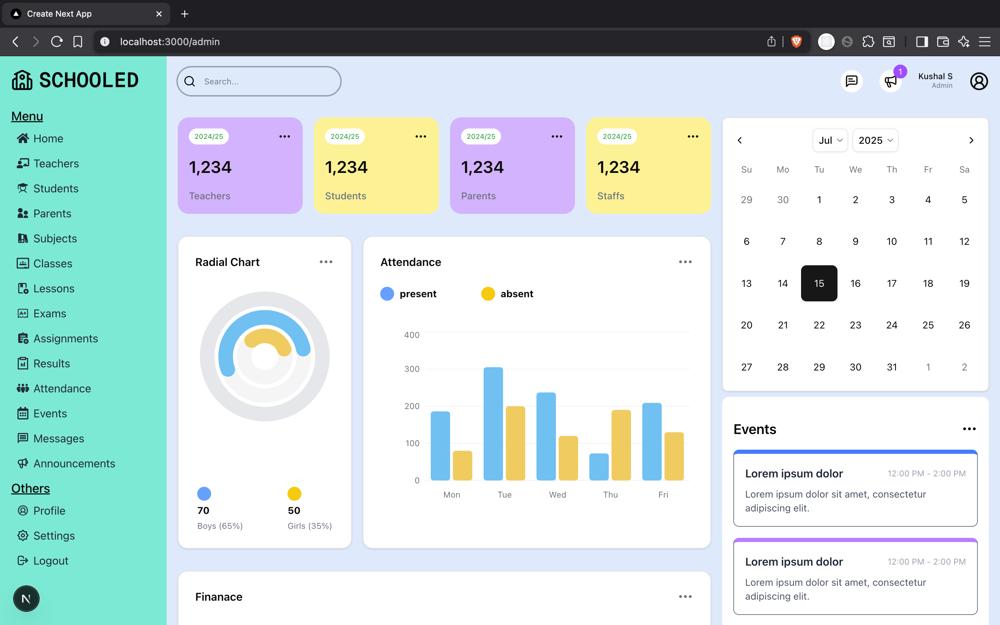

# Schooled: A Modern School Portal

This is a modern school management portal built with [Next.js](https://nextjs.org). It allows admins, teachers, students, and parents to manage and view school-related information through a clean and intuitive interface.

## Getting Started

First, run the development server:

```bash
npm run dev
# or
bun dev
```

Open [http://localhost:3000](http://localhost:3000) with your browser to see the result.

You can start editing the page by modifying `app/page.tsx`. The page auto-updates as you edit the file.


## Features

- Role-based login for Admin, Teacher, Student, and Parent
- Dashboard for managing students, teachers, classes, and more
- Responsive and modern UI
- Built with Next.js App Router

## Screenshots

## Home Page


## Dashboard Page
